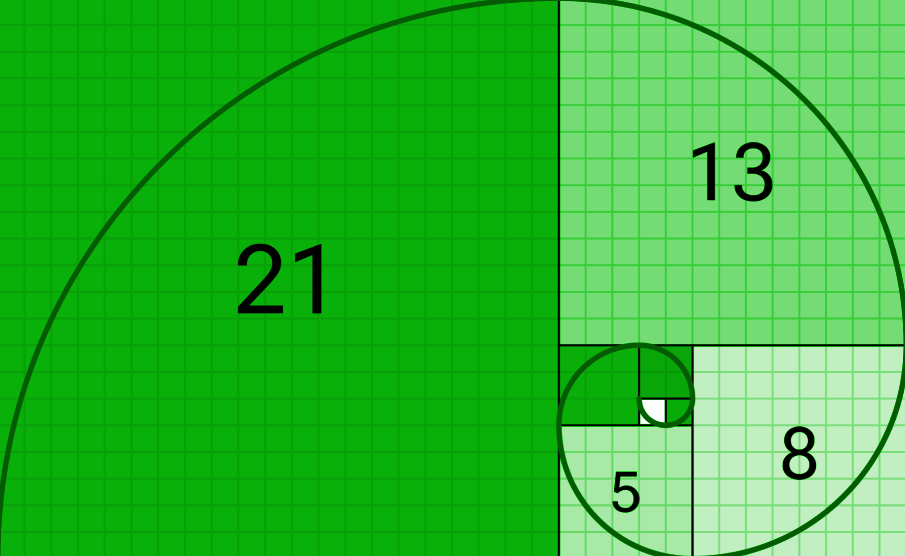

# 5. Strategy

## SEEDS Collaboratory DAO -

Attracting the right members to the ecosystem can be challenging but having a strategy in place of the type of members that can join the ecosystem and what it takes to drive the movement forward with an overall purpose.

The agreements in the SEEDS nucleus are the first creation of data into the blockchain transfering the usage of governance agreements such as intellectual property and other contractual terms. Defining the governance allows for flexible collaboration and data solutions to root energy into prototype projects allowing for experiential governance model.

The projects Prototype with regenerative feedback and data solutions are the dynamic feedback and fundamental storytelling in the ecosystem growth.

| <h4 id="_heading-h.3nlr7jcpilu6"></h4><h4 id="_heading-h.90l0z3du1n9d">The SEEDS Collaboratory DAO becomes the guardian and</h4><h4 id="_heading-h.67arfh6klrp4">the knowledge of Truth.</h4> |
| --------------------------------------------------------------------------------------------------------------------------------------------------------------------------------------------- |

Creating a solid ground for investors to participate in the different nods in the ecosystem Community and Bioregional DAOs, DHOs or DACs, can be created by others or self, so aggregation can occur within the ecosystem of light-hearted/like minded individuals who generate activity by self directing community budding at the vitality nodes, creating a branching that is member directed, self forming, and responsive to localility, climates and resources (wither and whether of the sprouting, trunking, and branching).

“Citizen” Member alignment and member influence is key for the vitality and future expertise in the SEEDS Collaboratory DAO, creating rewards with intention and purpose to keep evolving the ecosystem and the SEEDS Collaboratory DAO. The expertise and strategy will help the foundation for elections time frames. The badges, rewards and compensation will create a campaigning tool to have a framework of the level of commitment of each citizen in the nucleus Circles and Councils.

Denizen- a natural being by wright of the earth and of region. In the regenerative movement by nature, continuance of languaging that implies unexamined strictures of degenerative culture is sabotaging to us. Onboarding badge routes could include the awareness building of these degenerative nominatives and build trust in the new identifications.

The first three members and attractors voted into the SEEDS collaboratory DAO will help evolve the initial stage from the up. The right energy, expertise creates doorways and showing a level of commitment are what will define and formulate the right agreements based on wisdom, understanding and Consciousness.

The first members of each circle and council have to be carefully selected for their commitment that requires integrity, understanding, vision and love, embodying the community principals and facilitating wisdom. Here advantage is gained from an observance of cyclical nature of energy deployment, flowering, and harvesting and composting, core to the regenerative process: includes the trinity of trust, love, and presence in the mental realms, but awareness of the 4 realms to prevent confusion in the nature of response that is needed

According to the fibonacci spiral sequence that is mimicked through nature design and all kingdoms on EARTH and the basic design of the SEEDS Constitution.

### Roadmap ahead for SEEDS DAO

#### **Stepping stones and milestones Activation**

* Hypha to restart SC DAO and COSEEDS to zero members and original three members.
* Continues from there to propose policies and canvas creation of circles and SEEDS constitution. Process of emergency organically welcoming members.
* Members of the SEEDS DAO consist of HUmans in the nucleus.
* RoadMap of the process of SEEDS Commons to pass the responsibilities to the SC DAO to continue to fulfill the responsibilities.
* Transition roadmap for the whole ecosystem the existing Governance to empower and replace the Governance TK 2.0..Roadmap it needs to be designed!
* New collaboratory assuming authority but it hasn't been granted the reason the Roadmap and deployment needs to be in place. How it emerges and legitimacy for the whole ecosystem.
* Bootstrapping process and once you are from the initial members the DAO process can start where one step leads to the next steps.
* As the governance is being revised the opportunity to open the discussion to be more flexible and contracts can be more open with the SC DAO. Transition form the passport to the DAO.
* Community needs to be invited to the policies and proposals. The voice will be heard with reassurance that the process is based on TRUST.
* Keep the contract containing the currency with the governance v2 that will be taking place. Collective intelligence space is hard to transform into a new space. What are the plans on the transition of the technology.
* Moving into the action and leaving the conceptual space with a new proposal in place to trigger community members to start the SC DAO.
* The SEEDs ecosystem has to be able to control pay manage supervise updated all the contracts and the passport needs to be decommissioned in a coherent manner. Hypha has all the responsibilities as the SC DAO matures and will take naturally get in charge but also request Hypha for help and hire their own developers.
* in the blockchain in different wallets the emergence of good services and local markets. Stewarding all the SEEDS to have capital into the ecosystem without draining.
* Modified contract transitions. Programming is required from the working capital after the ecosystem is coherent and moving into a normal flow.
* A new constitution needs to be approved and needs to be a referendum from the original constitution.
* There are activities that are building in the SC DAO will build all the proposals to vote into the main structure to bootstrap and help projects. Stepping stones to bigger milestones.
* Invite the community as soon as possible and the HYPHA template will help with the DAO space as a positive place to vote and participate as an ecosystem.

| **The Dao is the way!** |
| ----------------------- |
