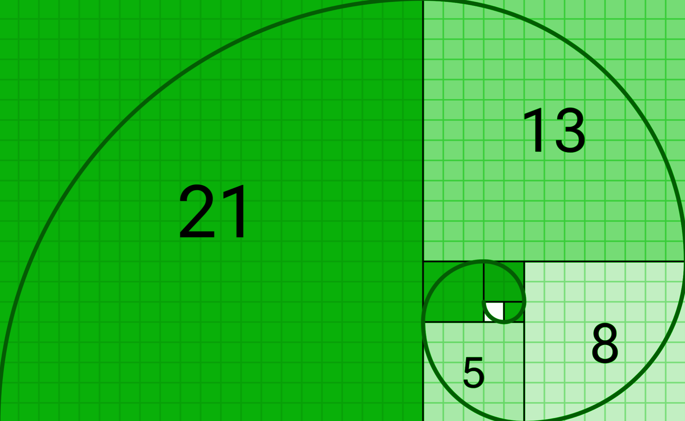

# SEEDS DAO \[Governance v.1 10.19.2022]

This proposal is part of the OS Hypha canvas requirement for activating the DAO in the HYPHA network

The proposal will be part of a series of 12 proposals as a basic template to start the activation of the SEEDS DAO.

SEEDS DAO Activation DAO OS Canvas

[https://docs.google.com/document/d/12\_cTwrtUpOrqamvYeuMX-Jyw84ZRIIUE/edit#](https://docs.google.com/document/d/12\_cTwrtUpOrqamvYeuMX-Jyw84ZRIIUE/edit)

### &#x20;

| 
Legitimacy | Coordination | Quantum | Mediation | Allocation of SEEDS | Councils | Authority | Community Proposals

Expanding future | Possabilities | Architecting Codes and Protocols | Developing our Capacities as our

Learning Journey | Integrating Collaborations and Building Bridges |
 |
| ----------------------------------------------------------------------------------------------------------------------------------------------------------------------------------------------------------------------------------------------------------------------------------------------------------------- |

### &#x20;

Governance

SEEDS Collaboratory DAO -

An evolution of this structure is influenced by the Constitution of SEEDS, using decentralized governance and sensemaking to better meet ours and our Earth’s needs. We want to steward a fundamental reversal of what society has done up to now, this DHO has potential to represent a reputable SEEDS node that is a friend and stabilizer of shared community.

**Internal Management and Administration Systems**

* **Within one Nucleus: {144 members}**
* **3 Circles:**
  * Governance: Policy
  * Deployment: Implementation
  * Economics: Currency
* **3 Councils**: Every circle requires an element of these three councils (Wisdom/Advisory/Facilitation):
  * Constitutional: PROTECT US,
  * Stewardship: GUIDE US,
  * Strategy: SHOW US

#### SEEDS Collaboratory DAO - Visual Model 

### Power Distribution Transparency 

**Genesis of the Nucleus**

As of December 2022, the first three members for the DAO have been voted to the SEEDS Collaboratory DAO. {Alexandra Escobar, Mark Epstein and Dannie Quilitzsch}.

* This is also a chance for applied ‘liquid Democracy’ where all voices/votes are consistently accountable to the Commons. The social query being; How to allow feedback to encourage and support improved function?
* The use of sacred geometry metaphors (spider’s web or Tree of Life) … they are means of acknowledging the POWER of collective action by consent of free individuals (where old paradigm manipulation/power-over/force does achieve “results” including disparity sickness and dysfunction). The metaphors are only as good as they enable group coherence and autopoiesis.
* The native notion of ‘Mending the Hoop’ which does not impose a sense of perfect symmetry or beauty of form achieved through exclusivity, but precisely the ACT of improvement over time, of Remembrance and Recovery. That regardless our role or skillset, that each player can do our part in “mending”

#### Member Intention Broad-Based Participation 

Greatest power lies between friends, communities, and the personal local areas rather than power flowing up by elections and motivation from the top down. Structurally the DAO enables individuals to play various roles. Digital trust, responsibility, and how you treat others will form a reputation.

**Membraneship criteria -**

* Members request permission to enroll in a role that has been clearly defined. The Core Team determines who is accepted and what is recorded on chain.
* Applications will be proposed seasonally in a series of waves or cycles.
* To be in the Nucleus you need to be a Citizen in SEEDS with a functioning wallet and a healthy reputation.
* A series of virtual questionnaire/educational instructions to welcome and coach the arrival of new members is to be innovated.

**How we share power -**

The DAO is capable of being responsible for replacing the aspects of project management, {from initiation, through to quality control and to completed systems} with self-organized systems and without centralization:

* This is frontier territory (applied Organomics & Holonic governance) where emphasis on truth, communication & transparency can provide an open window for future iterations to learn from its founders.
* The key is to create values that do not change arbitrarily over time, but to have flexibility built into the process from the beginning. Versatility and resilience over time in the DAO will be shaped by the evolution of roles that can rotate seasonally and be influenced by the cycles of the moon.
* Emphasis can be on clear expectations of capacity load, expected outcome and behaviors proposed upfront during the application process for roles.
* Prompts and support can help members unlock dormant capacities and upgrade their natural flow.
* Each member has the opportunity to demonstrate what right use of power looks like per role.
* Generate dialogue and storytelling at the edge of the Nucleus membrane, with those a high degree of interest for the opportunity to innovate.

#### &#x20;

#### Policy and Proposal Formulation Accountability 

The Proposal and smart contract will be DAOs main mode of decision making. Generating a living body of practical knowledge and experience, documented in the blockchain, that takes shape according to the involvement of its members and decisions of its Nucleus.

* Only Citizens in the DAO Nucleus hold the right to:
  * Submit a Proposal, vote on proposals
  * Help define the tasks, roles, behavior, expectations and agreements described in the experience of completing a quest. 
* Only Core Members of each Circle hold the right to:
  * Add, remove or change Roles;
  * Add, remove or change Policies;
  * Add, remove or change Domains;
* Only Guardians of the Treasury hold right to:
  * Process DHO Funding Proposals
* The quests are laid out for the members to self-assign tasks and collaborate on the desired quest to accumulate a final completion, witnessed to the whole purpose of the ecosystem. The final score will be a note that contributes to a list of quests.

### &#x20;

| 
<strong>Fair Share</strong>: Apply self-regulation and accept feedback to avoid debt

<strong>Earth Care</strong>: Incentivise or re-prioritize the value of regenerating the greater whole-

catch and store energy= build up some savings.

<strong>People Care</strong>: Obtain a yield= spend less money than you earn.
 |
| ------------------------------------------------------------------------------------------------------------------------------------------------------------------------------------------------------------------------------------------------------------------------------------------------------------------------------------------------- |

#### &#x20;

#### Priority Setting Responsiveness 

* First the Working Group agrees on the three Founders, then they create a proposal to initiate the next wave of members to support and define the council. Specific commitments and when to vote will continue to evolve as the DHO defines its foundation on chain. The final composition will be transparent in the ecosystem.

**Next iterations of DAO policy will need to include:**

* Voting Cycle
* Staging Proposals
* Proposal voting
* Referendums
* Funding Proposals
* Making Amendments
* Multi signature options,
* Acquiring sovereignty of its operating software,
* Tokens Distribution and Design
  * CoSEEDs Utility Token
  * Ability to pay for resources
* Updating the Roadmap
* Establish conflict resolution facilitation
  * During Conflict Resolution, the Support DHO must facilitate a process that allows the participant who brought the Tension, the "Proponent", to build a "Proposal" to resolve it. This Proposal must contain only the operations described as valid outputs from this Mode.

#### Tracking Shared Contributions Equity and Inclusiveness 

**How we operate:**

* Nucleus is taking care of the whole
* Impact metrics, tokens for work, rewards
* Agreements in an open space; quick quest or longer term engagement
* Prototyping
* Contribution accounting is a long term goal, short term reflection can be seen in gratitude
* Systemic accounting of a bookkeeper
* Badges are acknowledgements so you can do extra things.
* Individual members can have a collection of badges or roles.
* A tool kit for every member to resonate with the constitution and extension.
* A translator of technology and code

#### Stabilizing Internal Norms 

#### Language Empowerment 

* Membranship
* Councils
* Circles
* Nucleus
* CoSEEDs
* Ecosystem
* Badges
* Quests
* organomics
* holonic
* Recognition
* Organomics & Holonic governance
* multi sig
* On chain
* smart contract
* Founder Syndrome - where one or more founders maintain disproportionate power and influence following the effective initial establishment of the organization, leading to a wide range of problems.
* power
* voice token
